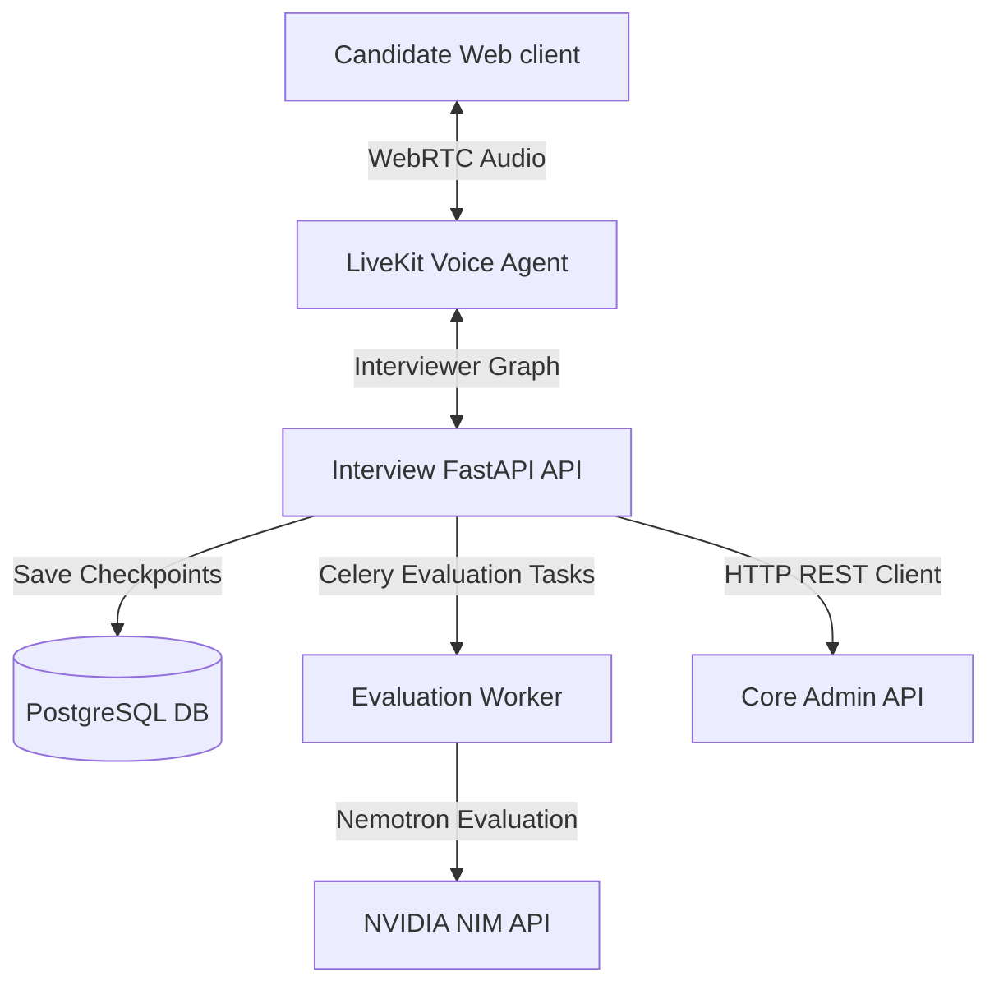

# Interview Engine Service

The Interview Engine Service is the real-time interaction and assessment engine of the iBot platform. It manages voice-based AI interviews, handles candidate reconnection states, runs the conversational state-machine, and processes final holistic evaluations.

---

## Technical Stack
- **Web Server:** [FastAPI](https://fastapi.tiangolo.com/) (Python 3.11+)
- **Conversational State Machine:** [LangGraph](https://langchain-ai.github.io/langgraph/) (Stateful orchestration & routing)
- **State Checkpointing:** `langgraph-checkpoint-postgres` (PostgreSQL backed session recovery)
- **WebRTC voice streaming:** [LiveKit Agents](https://docs.livekit.io/agents/) (Deepgram STT & TTS, VAD, client WebRTC audio streaming)
- **Evaluation Pipeline:** Asynchronous workers utilizing [Nvidia NIM](https://build.nvidia.com/) (Nemotron models)
- **Broker & Queue:** [Redis](https://redis.io/) and [Celery](https://docs.celeryq.dev/)
- **Dependency Manager:** [uv](https://github.com/astral-sh/uv)

---

## Architecture

The Interview Engine consists of three core components:



### Components Details
1. **FastAPI Application (`src/api`):** Manages candidate sessions entry points, generation of JWT tokens for WebRTC LiveKit room entry, and hooks for agent telemetry.
2. **Interviewer Voice Agent (`src/control/agents/livekit_agent.py`):** Runs as a LiveKit agent worker listening to rooms. It captures audio input from the candidate, transcribes it via Deepgram STT (`nova-3`), uses LLMs (Groq/OpenAI) to generate conversational responses, handles verbal interruptions, and reads responses via Deepgram TTS (`aura-2-andromeda`).
3. **Conversational LangGraph Workflow:** Employs LangGraph to build structured conversational nodes (e.g. ice-breaker, technical questions, follow-up questions, wrapped-up phase). The graph uses a PostgreSQL database checkpoint store, allowing candidates to lose connection and reconnect to the exact same conversational state.
4. **Holistic Evaluation Pipeline (`src/handlers`):** Triggered asynchronously at the end of the interview. The Celery task collects full transcripts, matches them with evaluation templates, runs high-context prompt configurations against Nvidia NIM APIs, parses detailed scorecards, and sends reports back to the Core database.

---

## Directory Structure
```text
interview-engine-service/
├── src/
│   ├── api/                   # FastAPI routing and entrypoints
│   ├── clients/               # Internal API clients to talk to the core-api-service
│   ├── config/                # Environment variables schema and validation
│   ├── control/               # Real-time control loops
│   │   └── agents/            # LiveKit agents, speech prompts, and LangGraph workflow
│   ├── core/                  # Engine orchestration services (livekit, token, evaluation managers)
│   ├── data/                  # Celery and Redis client initialization
│   ├── handlers/              # Celery tasks (asynchronous evaluation execution)
│   └── schemas/               # Verification schemas, models, contracts, and state objects
├── tests/                     # Unit and workflow verification tests
├── pyproject.toml             # Python dependencies and build rules
└── Dockerfile                 # Multi-stage container file
```

---

## Local Development & Setup

### 1. Prerequisites
- Python 3.11+
- [uv](https://github.com/astral-sh/uv) package manager.
- LiveKit credentials, Deepgram API key, Groq API key, and Nvidia NIM API key.

### 2. Environment Variables
Copy `.env.example` to `.env` and fill in:
```bash
cp .env.example .env
```
Key configuration values:
- `LIVEKIT_URL` / `LIVEKIT_API_KEY` / `LIVEKIT_API_SECRET`: Credentials to connect to the LiveKit cluster.
- `DEEPGRAM_API_KEY`: Speech-to-Text and Text-to-Speech credentials.
- `NVIDIA_NIM_API_KEY`: Access key for evaluation processing.
- `CORE_API_URL`: Path to the core admin API instance (e.g., `http://localhost:8000`).

### 3. Install Dependencies
```bash
uv sync --group dev
```

### 4. Running the API Server
Starts HTTP server for session setup and reconnection routing:
```bash
uv run uvicorn src.api.rest.app:app --host 127.0.0.1 --port 8001 --reload
```

### 5. Running the Voice Agent Worker
Listens for LiveKit room requests and boots active voice assistants:
```bash
uv run python -m src.control.agents.livekit_agent start
```

### 6. Running the Evaluation Worker
Handles asynchronous transcript analysis tasks:
```bash
uv run celery -A src.data.clients.celery_client.celery_app worker --loglevel=INFO --queues=interview.evaluation,interview.default --pool=prefork --concurrency=1
```

---

## Verification & Validation
Run quality commands:

```bash
# Code format check
uv run ruff format --check src tests

# Code lint check
uv run ruff check src tests

# Static typing check
uv run mypy src

# Unit test suites
uv run pytest
```
